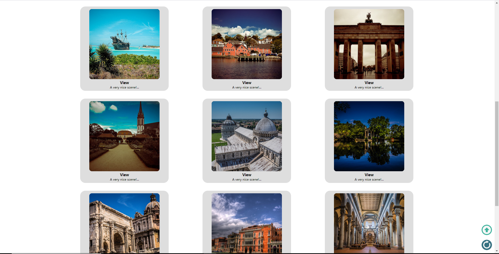
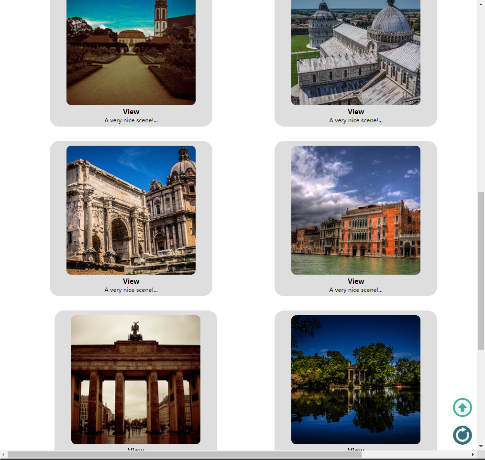

# PJ1开发文档
## 基本信息
+ 姓名：李臻欣
+ 学号：19302010007
+ Github 地址：https://github.com/woxihuanjiangguo/2020WEB_PJ1
+ Github Pages 地址：https://woxihuanjiangguo.github.io/2020WEB_PJ1/
## 项目完成情况
按照助教给的grade.pdf文件的评分条目一一核对下来，均已完成各项功能。  
会着重介绍bonus的实现方案，同时在后文会给出网站的部分截图，作为网站显示效果的参考。对于网站逻辑部分的内容，实现了上传图片后
图片在页面中显示这一要求，以及select选择器的二级联动，都是用js实现的，参考了csdn等网站并且自己
稍微做出了改进。表单等相关部分的逻辑暂时还并不完善。
## Bonus完成情况与解决方法
### bonus1  
在有许多图片一起呈现的页面上均使用了自由版式，而不是正方形的图片。以下为主要的代码，使用了object-fit:cover的属性，
并且设定了宽度，可以使得图片在不改变比例的情况下，从原有的长方形版式
显示为正方形的样子。此处展示浏览页的截图，在bonus2中展示主页的相关截图。


主要代码  
```css
img{object-fit: cover;
        width: 270px;
        height: 270px;
        border-radius: 10px;}
```
### bonus2  
能够实现在大（PC）、中（iPad）、小（手机）三种屏幕上分别对应不同的版式排布，
缩小浏览器宽度时会出现两次版式上的改变，即对应前面三种情况。
我主要用媒体查询，即@media实现，我将屏幕尺寸划分为三段：1024px及以上，600px—1024px，与600px及以下。
在每个页面的css文件中，固定页面主体内容的大小（以px为单位），分别修改中小屏幕的
网页排布，使其尽可能地利用屏幕空间，排布自然合理。对于每一个页面，我都实现了
这个功能。下面以网站主页为例。
#### 大屏幕
+ 头图（大）  


+ 中间（大）  


+ 页脚（大）  


#### 中屏幕
+ 头图（中）  


+ 中间（中）  


+ 页脚（中）  


#### 小屏幕
+ 头图（小）  


+ 中间（小）  


+ 页脚（小）  


PS：我在登录与注册页面也设计了一个响应式，根据浏览器宽度的变化设置了三张不同尺寸的背景图片。
这在本地网页的打开显示正常，但是在github pages中，由于某些因素，只能加载出来最大的那张图片（虽然也很慢），
另外两张窄一些的图片不能加载出来。个人认为这并没有太大的影响。
### bonus3  
个人认为页面较为美观，并没有非常突出的问题。网页截图见上。
## 对PJ1与本门课的意见与建议
PJ文档非常有趣！很有创意！没什么特别的意见。